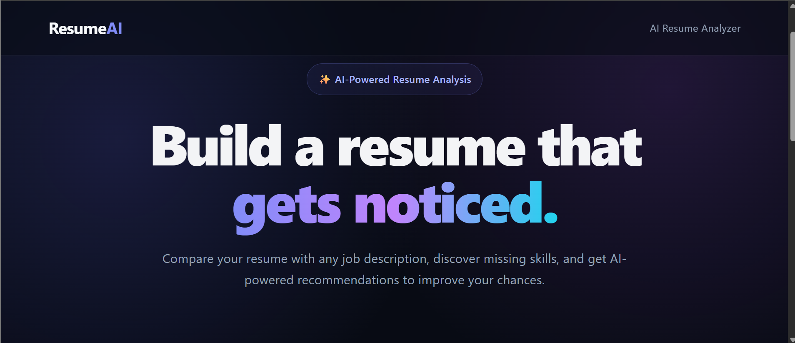
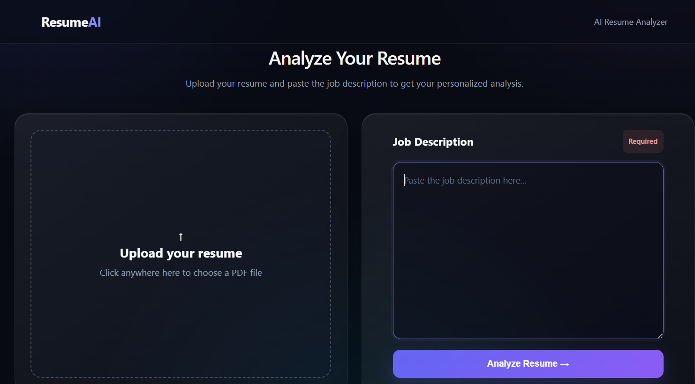
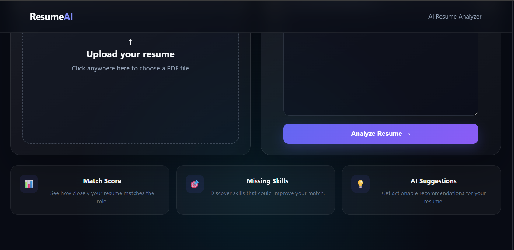
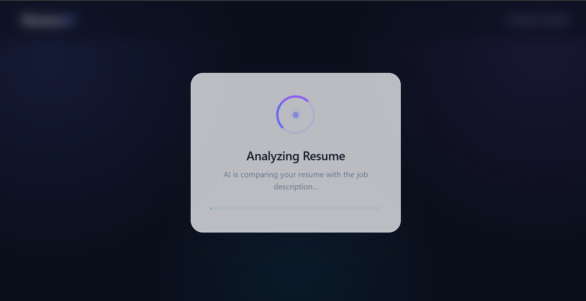
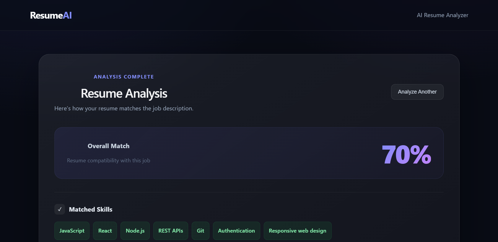
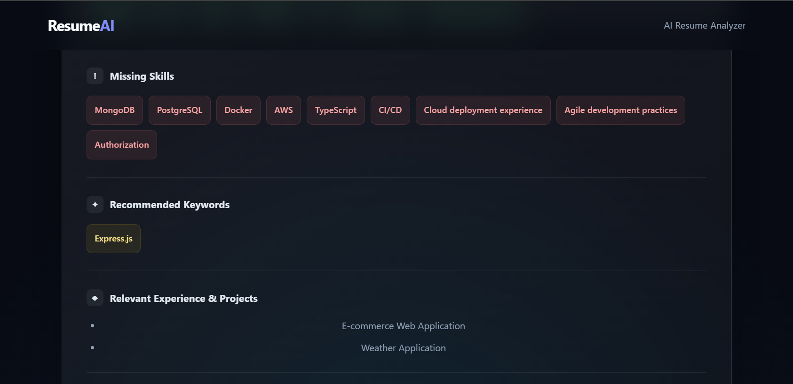
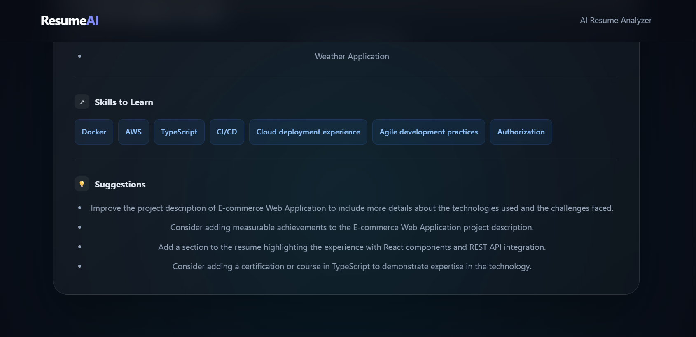
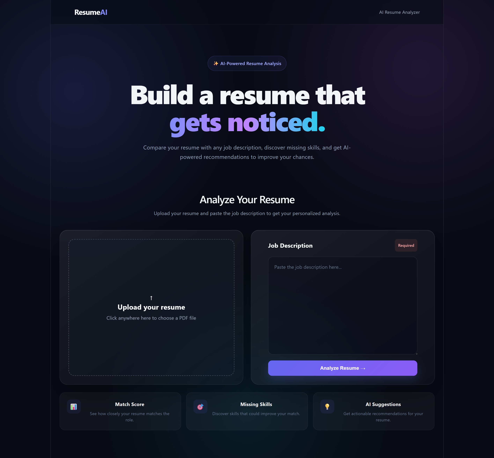
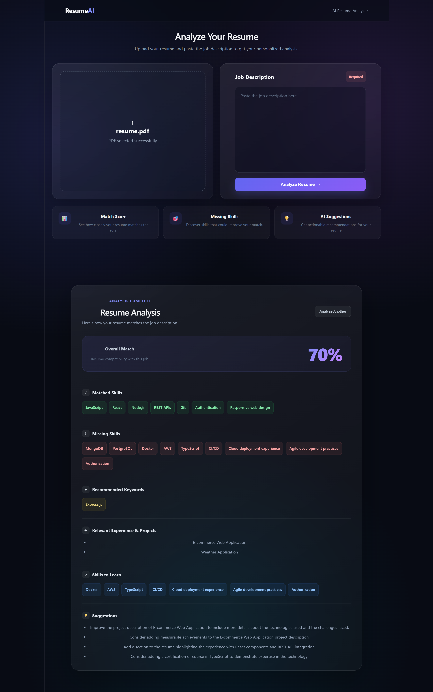

# AI Resume Analyzer

An AI-powered resume analyzer that compares a candidate's resume with a job description and provides a structured analysis of how well the resume matches the job requirements.

The application uses a React frontend, FastAPI backend, and a locally running Ollama model to analyze the resume.

## Features

* Upload a resume in PDF format
* Extract resume text from PDF
* Enter a job description
* Analyze resume against the job requirements
* Generate an overall match percentage
* Identify matched skills and requirements
* Identify missing skills and requirements
* Find relevant projects and experience
* Recommend relevant ATS-friendly keywords
* Suggest skills to learn
* Provide resume improvement suggestions
* Temporary PDF files are automatically deleted after processing
* Responsive glassmorphism-based UI
* Loading screen while analysis is running

## Tech Stack

### Frontend

* React
* Vite
* JavaScript
* CSS

### Backend

* Python
* FastAPI
* Uvicorn
* LangChain
* LangChain Ollama
* PyMuPDF

### AI

* Ollama
* Llama 3.2

## How It Works

```text
Resume PDF
     ↓
React Frontend
     ↓
FastAPI Backend
     ↓
PDF Text Extraction
     ↓
Ollama / Llama 3.2
     ↓
Resume + Job Description Analysis
     ↓
Structured JSON Result
     ↓
React Result Dashboard
```

## Project Structure

```text
AI-Resume-Analyzer/
│
├── backend/
│   ├── main.py
│   ├── analyzer.py
│   ├── requirements.txt
│   └── .gitignore
│
├── frontend/
│   ├── src/
│   ├── public/
│   ├── package.json
│   └── ...
│
├── .gitignore
└── README.md
```

## Requirements

Before running the project, make sure you have:

* Python 3.10+
* Node.js
* npm
* Ollama

You also need to have the required Ollama model installed.

## Getting Started

### Clone the Repository
```bash
git clone https://github.com/MickyMaikash/AI-Resume-Analyzer.git
```
and Then 
```bash
cd AI-Resume-Analyzer
```

## Backend Setup

Open a terminal and go to the backend folder:

```bash
cd backend
```

Create a virtual environment:

```bash
python -m venv venv
```

Activate it on Windows:

```powershell
venv\Scripts\activate
```

Install the Python dependencies:

```bash
pip install -r requirements.txt
```

Make sure Ollama is running and the required model is available.

For example:

```bash
ollama pull llama3.2
```

Start the FastAPI server:

```bash
uvicorn main:app --reload
```

The backend will normally run at:

```text
http://127.0.0.1:8000
```

## Frontend Setup

Open another terminal and go to the frontend folder:

```bash
cd frontend
```

Install dependencies:

```bash
npm install
```

Start the development server:

```bash
npm run dev
```

Open the URL shown by Vite in your browser.

## Using the Application

1. Open the frontend.
2. Upload your resume as a PDF.
3. Paste the job description.
4. Click **Analyze Resume**.
5. The backend extracts the resume text.
6. The AI analyzes the resume against the job description.
7. The result is displayed in the frontend.

## Analysis Result

The analyzer returns information such as:

```json
{
  "overall_match_percentage": 60,
  "matched_skills_and_requirements": [],
  "missing_skills_and_requirements": [],
  "relevant_experience_and_projects": [],
  "recommended_keywords": [],
  "skills_to_learn": [],
  "specific_suggestions": []
}
```

## Important Notes

The AI-generated match percentage is an estimate and should not be treated as an objective hiring score.

The application is designed to help candidates understand how their resume aligns with a specific job description and where their resume could be improved.

The analyzer is also instructed not to invent skills, projects, experience, or certifications that are not supported by the resume.

## Security

Uploaded resumes are temporarily stored on the backend only for PDF text extraction.

The temporary PDF file is deleted after the request finishes, including when an error occurs.

Do not commit API keys, environment variables, virtual environments, or uploaded resumes to GitHub.

## Screenshots

### 1. Home / Introduction



### 2. Resume Analyzer



### 3. Footer



### 4. Loading Screen



### 5. Analysis Result — Overview



### 6. Analysis Result — Skills



### 7. Analysis Result — Suggestions



### 8. Full Application — Without Result



### 9. Full Application — With Result




## Future Improvements

* Improve match-score calculation
* Add resume section-by-section analysis
* Add ATS formatting analysis
* Add downloadable analysis reports
* Add authentication
* Add resume history
* Improve error handling
* Add more AI models
* Improve analysis accuracy
* Add job-description keyword visualization

## Author

Built as a learning project to explore:

* React
* FastAPI
* LLM applications
* Ollama
* LangChain
* PDF processing
* AI-powered resume analysis
* Full-stack application development
